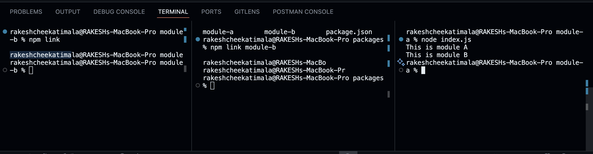
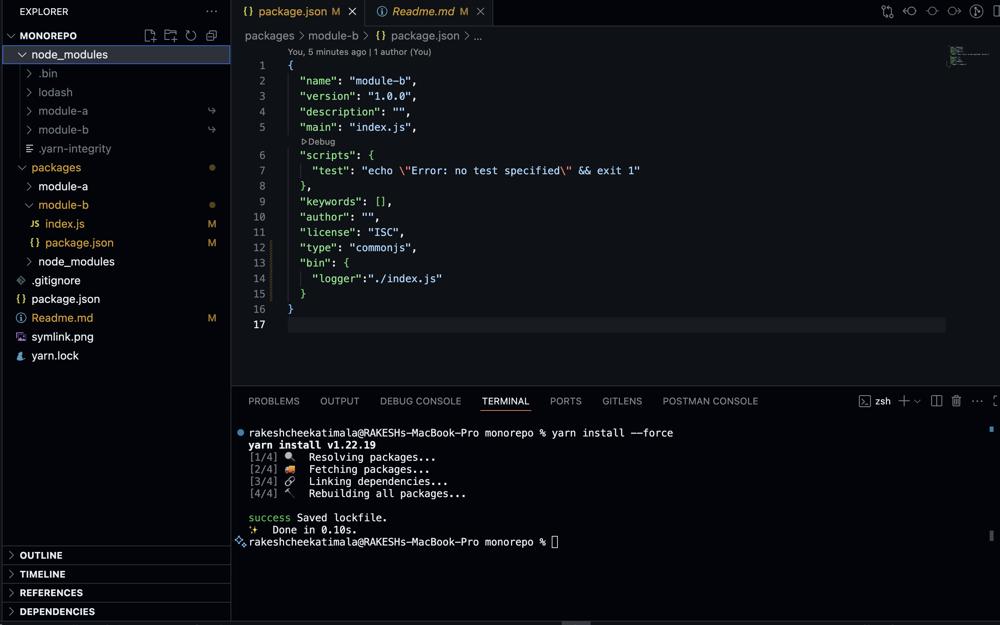

Using Symlinks for Local Development


 A symlink (symbolic link) is a special type of file that points to another file or directory. In Node.js projects, symlinks are commonly used to resolve local node_modules dependencies, allowing you to test and develop packages in a monorepo or across multiple projects without publishing them to a registry.

Benefits
Local Testing: Instantly test changes in shared modules without reinstalling or publishing.
Efficient Development: Streamline workflows by linking packages directly, reducing duplication and versioning issues.
Easy Collaboration: Share code between projects in a monorepo setup.

# How to Create a Symlink

You can use the npm link or yarn link command to create symlinks for local packages:

```
# In the package directory you want to link
npm link

# In the project where you want to use the linked package
npm link <package-name>
```

This will create a symbolic link in your node_modules folder, pointing to the local package.

# Example Workflow

Navigate to the package you want to share (e.g., module-a).
Run npm link to make it globally available.
In your main project or another module, run npm link module-a to use the local version.




Takeaway: Symlink is system shortcut to file or directory (Symbolic link)

# Workspaces in Monorepos

Workspaces are a way to set up multiple packages within a single repository, allowing them to interact and share dependencies efficiently. This approach streamlines development, testing, and collaboration by managing related packages together. In a Node.js monorepo, workspaces enable:

- **Centralized Dependency Management:** Install dependencies for all packages from the root, reducing duplication. Automatic symbolic linking for your project.
- **Inter-Package Collaboration:** Easily reference and use code from other packages in the same repo.
- **Simplified Versioning:** Coordinate releases and updates across packages.

Popular tools for managing workspaces include npm, Yarn, and pnpm. To configure workspaces, define them in your root `package.json`:

```json
{
  "workspaces": {
    "packages": [
      "packages/module-a",
      "packages/module-b"
    ],
  }
}
```

This setup helps you develop, test, and maintain multiple packages efficiently within a single codebase.

## Simplied version of above

```json
{
  "workspaces": {
    "packages": [
      "packages/*"
    ],
  }
}
```

## Hoisting 

I have installed the lodash package in module-a however yarn workspaces allows hoisting this installed
package is at the root level & shared by both applications. 

# How Yarn deals if two packages in your monorepo require different versions of the same library.

Yarn will try to deduplicate dependencies as much as possible. However, if the version requirements are incompatible, Yarn will:

- Install one version of the library in the root node_modules (if it satisfies the majority or the top-level requirement).

- Install the other version inside the node_modules of the package that specifically needs the incompatible version.


## How to want to omit any libary that you want to hoist

```json
 "nohoist": [
      "**/lodash"
 ]
```

# Bin Scripts 

Bin scripts are executable files defined in a package (usually in Node.js projects) that can be run directly from the command line. They are specified in the bin field of a package.json file, mapping command names to script files.

You use bin scripts when you want to provide command-line tools or utilities as part of your package. For example, if your package offers a CLI (Command Line Interface), you would define a bin script so users can run your tool with a simple command after installing your package globally or as a dependency.

Typical use cases:

- Creating CLI tools (e.g., linters, build tools, generators)
- Automating tasks (e.g., scripts for deployment, testing)
- Providing developer utilities

In summary, bin scripts are for exposing executable commands to users of your package.

# How to add bin scripts 

Example in module-b , i would like to make index.js exposed as logger in package.json


```json
    "bin": {
    "logger":"./index.js"
  }
```


# To reflect the bin scripts run this at root level 

```
yarn install --force

```



# How to fix this error syntax error when bin scripts is used & ran

```
rakeshcheekatimala@RAKESHs-MacBook-Pro monorepo % npm run logger 

> packages@1.0.0 logger
> logger

/Users/rakeshcheekatimala/Desktop/Learnings/monorepo/node_modules/.bin/logger: line 1: syntax error near unexpected token `'This is module B''
/Users/rakeshcheekatimala/Desktop/Learnings/monorepo/node_modules/.bin/logger: line 1: `console.log('This is module B');'
rakeshcheekatimala@RAKESHs-MacBook-Pro monorepo % 
```

Fix for the above problem add this to index.js in module-b

```
#!/usr/bin/env node
console.log('This is module B');
```

# How to run build or test commands without changing directory when using workspaces

```
  yarn workspace module-b build
```

# How to add a library to module-a using yarn workspace

```
  yarn workspace module-b react
```

Original Source: [Workspaces](https://classic.yarnpkg.com/en/docs/workspaces/)